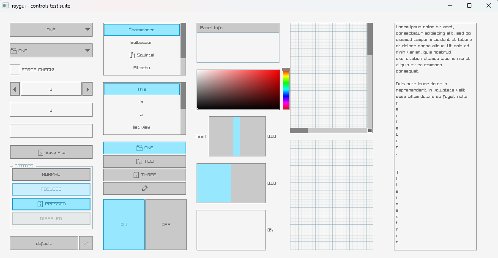

# Raylib Auto GUI Layout Library

### Discord: https://discord.gg/NMxxQK9kZt

A C99 library designed to be used with Raylib and Raygui for creating immediate mode responsive GUI.

## Notice
This project is early in development and may be missing desired functionality, though the layout algorithm should be complete enough to use in a project. Please feel free to contribute a PR or report bugs with MRPs attached.
Also, if you find something with this library that makes it in any way janky to work with, please submit your feedback! Part of the goal of this library is for my own learning, so your outside perspective is greatly appreciated!

## Credits
A big thanks and credit extended to Nic Barker, creator of Clay.h and his wonderful educational video on the topic. His library also supports Raylib and is highly recommended. (You will likely find no need for this library at all if you check out his, honestly.) Go use it! It is also likely that Clay computes layout faster than this library (TODO:: micro-benchmarks).

## Goals
So why create this library if Clay already exists? First and foremost, because Nic's video inspired me to try making one. Second, this library is designed with slightly different goals:
1. It uses the same controls that Raylib and Raygui use while keeping their native styling by default as well as keeping these controls exposed via function calls.
2. It allows the developer to define their own draw functions for the controls. In addition, within these functions, custom logic can be used to adjust the look and behavior.
3. (This is a minor contrast.) This library avoids using designated initializers so that legacy C++ can be used if desired (though you'll likely not need to).

## Usage
Using CMake, add this to your project with add_subdirectory(rlautolayout) or similar.
See CMakePresets.json and the example/ folder for more information.

## Library Structure
rlauto is made of 2 basic components:
1. A tree structure as implemented in tree.h and tree.c. This implements all the layout logic and simply calls draw callbacks. This is meant to be mostly self-contained and have no dependencies except for the c std library. Currently some Raylib structs are needed but could easily be defined with a few tweaks within the library if desired.
2. A collection of draw callbacks. These are the actual draw calls that will display the GUI. These are functions of type void(Layout*, void*). Theoretically, a developer could define their own draw calls that don't depend on Raylib at all (some typedefs are missing for this, but should be trivial to add if desired). raylib_draw_functions.h and raygui_draw_functions.h implement Raylib-specific draw calls for use with the layout tree. Note that, though these are draw calls, they can actually contain any logic needed to be executed during the drawing step and don't need to actually draw anything.